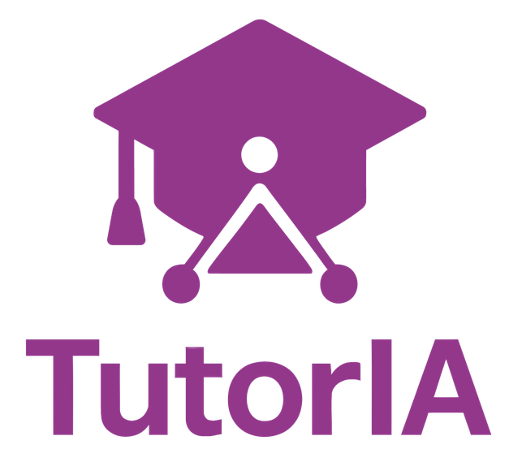
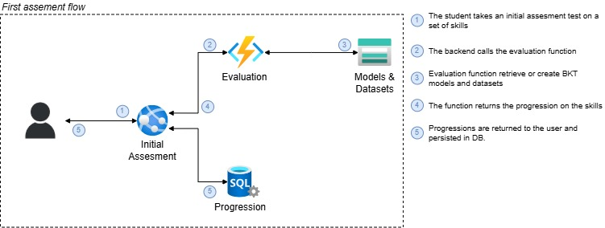
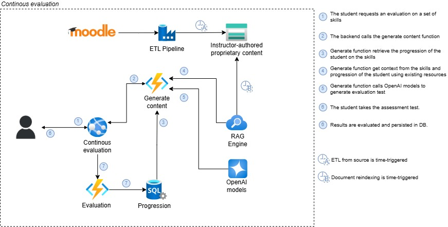

# TutorIA

Este proyecto nace a raíz de la competición [Reboots 2025](https://www.atmira.com/reboots/ "Reboots") llevada a cabo por Atmira.




---

Tres astros 🌠 se han alineado para que TutorIA sea una (semi) realidad:


<table>
  <tr>
    <td align="center">
      <br>
      <strong>Javier Alvarez</strong><br>
      🧠 .NET Developer<br>
🔗 <a href="https://www.linkedin.com/in/javier-%C3%A1lvarez-cuevas-1771ba19b/">LinkedIn</a><br>
      <em>"Mi compás hace cuadrados"</em>
    </td>
    <td align="center">
      <br>
      <strong>Olmo Arquero</strong><br>
      💻 Data Scientist<br>
🔗 <a href="https://www.linkedin.com/in/olmo-arquero-peinazo-4a78912ba/">LinkedIn</a><br>
      <em>"Lalala"</em>
    </td>
    <td align="center">
      <br>
      <strong>Miguel Díaz</strong><br>
      📐 IA Engineer<br>
	        🔗 <a href="https://www.linkedin.com/in/migueldiazlozano/">LinkedIn</a> · 🌐 <a href="https://miguel.diazlozano.com/">Web</a><br>
      <em>"Ctrl+Z es mi religión"</em>
    </td>
  </tr>
</table>

---

> 🤖 *"La IA no nos va a reemplazar, pero seguro que nos echa una mano para entregar a tiempo."*


## 🧠 Descripción general

`TutorIA` es un proyecto experimental que busca desarrollar un sistema inteligente para **evaluar el estado de aprendizaje de un alumno** universitario y generar un **itinerario formativo personalizado** (*learning path*), en función de lo que el alumno sabe o no sabe sobre los conocimientos previos necesarios para acceder a una nueva asignatura. Para ello se aplican técnicas de IA tradicional, encargadas de modelar el conocimiento de un alumno mediante modelos paramétricos, e IA generativa encargada de generar pruebas y contenido a medida para el alumno en función de sus necesidades.

### 📊 Evaluación del conocimiento

Para estimar el nivel de conocimiento previo del alumno sobre una asignatura objetivo, `TutorIA` emplea un enfoque basado en **Bayesian Knowledge Tracing (BKT)**. Este modelo probabilístico permite rastrear el dominio de un conjunto de habilidades o conceptos por parte del alumno, a partir de sus respuestas a preguntas relacionadas.

BKT asume que cada concepto puede estar **aprendido o no aprendido**, y actualiza la probabilidad de que un alumno haya aprendido dicho concepto tras cada interacción (por ejemplo, una respuesta correcta o incorrecta). El sistema se basa en cuatro parámetros clave:

- **P(L₀)**: Probabilidad inicial de que el alumno conozca el concepto.
- **P(T)**: Probabilidad de que el alumno aprenda el concepto después de una oportunidad de práctica.
- **P(G)**: Probabilidad de que el alumno adivine correctamente sin conocer el concepto.
- **P(S)**: Probabilidad de que el alumno falle a pesar de conocer el concepto (desliz).

Este modelo permite construir un **perfil dinámico de conocimiento** que evoluciona en función de las respuestas del alumno, y que servirá como base para generar itinerarios formativos personalizados y adaptativos.


### 📚 Generación del itinerario adaptado

Una vez evaluado el nivel de conocimientos del alumno mediante el modelo BKT, `TutorIA` genera un **itinerario formativo personalizado** (*learning path*) que tiene en cuenta sus fortalezas y debilidades en las distintas habilidades evaluadas.

El contenido del itinerario no se genera desde cero, sino que se construye a partir de **materiales creados previamente por el profesorado** (como presentaciones, PDFs, cursos o ejercicios). Este enfoque permite mantener la coherencia con los objetivos docentes de la asignatura. Para seleccionar y adaptar estos recursos, se emplea un enfoque de **RAG (Retrieval-Augmented Generation)**, combinando recuperación de documentos relevantes con generación de explicaciones o preguntas adaptadas al nivel del alumno.

> 🎛️ El profesorado tiene control indirecto sobre el contenido del itinerario, ya que puede **seleccionar, filtrar o excluir** recursos disponibles, asegurando así la calidad y pertinencia del material utilizado por la IA.

Durante el proceso, el alumno recibe:

- **Feedback explicativo** sobre sus respuestas, extraído o sintetizado a partir del contenido proporcionado por los docentes.
- **Referencias directas** a los documentos más relevantes que debe consultar para reforzar conceptos específicos.
- **Recomendaciones personalizadas** para avanzar progresivamente hacia los prerrequisitos de la asignatura objetivo.

Al finalizar el recorrido o la nueva fase de evaluación, se vuelve a invocar el modelo **BKT** para **actualizar el estado de conocimiento del alumno**, manteniendo el sistema en constante adaptación.


### 🌀 Flujo típico

A continuación se muestra un ejemplo de cómo un alumno interactúa con `TutorIA` para prepararse de forma personalizada antes de cursar una nueva asignatura:

---

#### 🎓 Caso: Clara quiere prepararse para la asignatura "Álgebra Lineal"

1. **Selección de asignatura objetivo**
   - Clara accede a la plataforma y selecciona *Álgebra Lineal* como la asignatura que quiere preparar.

2. **Evaluación inicial**
   - El sistema presenta a Clara un conjunto de preguntas diagnósticas adaptadas a las habilidades previas necesarias (matrices, operaciones básicas, sistemas de ecuaciones, etc.).
   - Sus respuestas son analizadas mediante el modelo **Bayesian Knowledge Tracing (BKT)** para estimar su nivel actual en cada skill evaluada.

3. **Generación del itinerario personalizado**
   - A partir del diagnóstico, el sistema construye un *learning path* personalizado usando material validado y seleccionado por el profesorado.
   - Clara recibe actividades específicas para reforzar conceptos que aún no domina, junto con explicaciones adaptadas mediante **RAG (Retrieval-Augmented Generation)**.
   - Cada explicación incluye:
     - Feedback sobre su error o acierto
     - Enlaces a recursos recomendados (PDFs, vídeos, diapositivas del curso, etc.)

4. **Progreso y re-evaluación**
   - Tras completar varias actividades, el modelo BKT se actualiza y refleja el nuevo estado de conocimiento de Clara.
   - En función de su progreso, el sistema adapta o expande el itinerario formativo.

---

> ✅ Este flujo garantiza un aprendizaje adaptado, trazable y centrado en el alumno, con el respaldo y supervisión indirecta del profesorado.


# 🧪 Pero, todo esto es *invent*, ¿no?

¡Qué va! No es magia, es ***CENCIA***.  
Aquí te contamos cómo se cocina `TutorIA` por dentro: qué tecnologías usamos, por qué las elegimos y cómo se conectan entre sí. ¡Con cafelito en mano, claro! ☕


## 🛠️ Tecnologías utilizadas

`TutorIA` combina distintas tecnologías modernas para construir un sistema robusto, escalable y fácil de mantener. A continuación, te explicamos cada una:

- 🧠 **Azure OpenAI**
  - Utilizado para los modelos de lenguaje (IA generativa) que generan, explican, y adaptan el contenido educativo.
  - **Motivación**: Facilidad de integración, cumplimiento de requisitos éticos y legales, y opciones avanzadas de privacidad.

- 🔍 **Azure AI Search**
  - Se encarga de recuperar los recursos más relevantes en el proceso de generación aumentada por recuperación (RAG).
  - **Motivación**: Alta precisión en búsquedas semánticas sobre documentos educativos.

- 🗂️ **Azure Blob Storage**
  - Almacena el repositorio documental del profesorado: PDFs, presentaciones, guías, etc.
  - **Motivación**: Escalabilidad y fácil integración con Azure Search para el pipeline RAG.

- 🧪 **Python**
  - Lenguaje principal para los módulos de evaluación del conocimiento (BKT) y generación adaptativa de contenido.
  - **Motivación**: Ecosistema rico en librerías educativas, científicas y de IA (***long live Langchain!***).

- 🔄 **Azure Functions**
  - Microservicios serverless que encapsulan la lógica de negocio del sistema (evaluación, planificación, feedback...).
  - **Motivación**: Permite escalar bajo demanda y reducir costes en producción.

- 📦 **Docker**
  - Contenerización de los módulos para facilitar despliegues locales, en la nube o entornos mixtos.
  - **Motivación**: Portabilidad, pruebas consistentes y enfoque cloud-agnostic.

- 💻 **.NET**
  - Framework utilizado para desarrollar la interfaz web del alumno y del docente.
  - **Motivación**: Buen rendimiento, madurez del ecosistema y compatibilidad con entornos empresariales.

---

> ⚙️ Todas estas piezas se orquestan pensando en:
> - **Escalabilidad**: poder adaptarse a grandes volúmenes de alumnos.
> - **Privacidad**: garantizar la seguridad de datos sensibles y educativos.
> - **Portabilidad**: permitir despliegue en diferentes nubes o entornos locales según necesidad.

## Menos listas y más imágenes
Sí, nosotros tambien somos de esos. Vamos al lío.

### 🧪 Evaluación inicial

Cuando el alumno accede por primera vez a `TutorIA`, lo hace a través de una aplicación web desplegada en un **Azure App Service**. Allí se le invita a realizar una **evaluación diagnóstica**, diseñada para conocer su nivel actual en los conocimientos previos necesarios para una asignatura objetivo.

Esta evaluación no es un examen más: es una serie de preguntas generadas y organizadas para **modelar su conocimiento en términos de maestría**, es decir, identificar qué sabe, qué no, y qué tan cerca está de dominar cada skill. Detrás del telón, esto lo gestiona una **Azure Function App**, que ejecuta la lógica del modelo **BKT (Bayesian Knowledge Tracing)** para ir actualizando en tiempo real el perfil de conocimiento del alumno.

Toda esta maquinaria se apoya en una **Azure Storage Account**, que guarda los modelos preentrenados, los bancos de preguntas y los datos intermedios generados durante la prueba. Una vez completada la evaluación, los resultados se **persisten en una base de datos relacional en Azure SQL Server**, para que el sistema pueda consultarlos más adelante y generar el itinerario formativo adaptado.

---

#### 🧩 ¿Y todo esto cómo se ve?

Sí, sí… mucha teoría, pero ¿cómo se conecta todo esto por detrás?  
Aquí te dejamos un esquemita para entender mejor cómo fluye la información en esta fase inicial:



> ☝️ *Spoiler: sí, hay muchas flechas, pero cada una tiene su razón de ser.*

### 📚 Generación del itinerario adaptado

Vale, ya sabemos lo que el alumno domina y lo que no… ¿y ahora qué?  
Pues ahora empieza la parte divertida: la generación dinámica del **learning path personalizado**, ajustado en tiempo real a sus necesidades concretas.

El alumno puede acceder a la plataforma en cualquier momento y solicitar una **nueva prueba personalizada**. ¿Quién la crea? Una **Azure Function App**, claro. Esta función es la que contiene la lógica mágica (bueno, más bien IA científica) que decide qué preguntas lanzar, en qué orden, y con qué grado de dificultad.

Este proceso no ocurre en el vacío: la generación se basa en dos pilares fundamentales:

- 📄 **Extracción de información de plataformas**: Pipelines de ETL extraen el contenido de las principales plataformas educativas utilizadas cada cierto tiempo. Esto habilita integración directa de TutorIA sin causar fricción con sistemas existentes.
- 📂 **Recuperación de información contextual**: gracias a **Azure AI Search**, el sistema identifica qué recursos del repositorio del profesorado (almacenado en Azure Blob Storage) son más relevantes para las habilidades que el alumno necesita reforzar.
- 🧠 **Modelos de lenguaje (LLMs)**: una vez recuperado el contexto, los modelos de **Azure OpenAI** se encargan de generar preguntas adaptadas, explicaciones a medida y feedback inteligente.

> 🧑‍🏫 Todo este proceso está **alimentado exclusivamente por materiales creados y aprobados por el profesorado**. Esto permite al docente tener **control indirecto** sobre el contenido que se presenta al alumno, seleccionando qué documentos son visibles para la IA generativa y cuáles no.

Durante la interacción, el sistema sigue evaluando al alumno de forma continua. Cada respuesta contribuye a actualizar su perfil en tiempo real a través del modelo BKT. Esto permite adaptar no solo el contenido, sino también la progresión, el ritmo y las recomendaciones futuras.

---

### 🧩 ¿Y esto cómo se conecta?

Aquí te dejamos otro diagrama bonito (sí, nos gustan los diagramas) que muestra cómo fluye todo este tinglado:



> 🤖 *Detrás de cada pregunta adaptativa hay IA, pero también mucho trabajo docente que la respalda.*

## 🚀 ¿Y esto lo puedo probar?

¡Claro que sí! Como diría Goyo Jiménez: **"No lo digo... ¡lo hago!"**  
Queremos que puedas cacharrear con `TutorIA`, así que te lo hemos puesto fácil para que lo despliegues en local.

---

### 🖥️ Despliegue en local

Hemos preparado un archivo `.env.template` con todas las variables que necesitas configurar para que el sistema funcione correctamente en tu máquina.  
Y sí, lo sabemos, **no hay pipeline de despliegue automática aún**... pero confiamos en tu comprensión. Además, piensa que el diseñador del frontal de Azure también tiene que comer.

A continuación, te explicamos qué significa cada variable y cómo agruparlas para que no te pierdas. Rellena el archivo `.env.template` como te indicamos y renombralo a` .env`.

---

#### 🗂️ Variables de almacenamiento

Estas variables definen cómo se accede a tus recursos en Azure Blob Storage y dónde se encuentran los archivos de evaluación y modelos. Las rutas puedes definirlas como quieras.

```env
AZURE_STORAGE_CONNECTION_STRING=        # Cadena de conexión a tu cuenta de Azure Storage

CSV_PATH=                               # Ruta base a los archivos CSV de habilidades y recursos
EVALUATION_CSV_PATH_NON_TRAINED=        # CSV con resultados de evaluaciones iniciales (antes del entrenamiento)
EVALUATION_CSV_PATH_TRAINED=            # CSV con resultados tras pruebas adaptadas (ya entrenado)
EVALUATION_PATH=                        # Carpeta donde se almacenan los datos de sesiones de evaluación
MODEL_PATH=                             # Ruta a los modelos BKT persistidos
```
#### 🤖  Variables de Azure OpenAI

Estas variables permiten conectar con los servicios de IA generativa que usamos para crear contenido adaptado, preguntas y feedback:
```env
AZURE_OPENAI_API_KEY=                   # Clave de autenticación para Azure OpenAI
AZURE_OPENAI_ENDPOINT=                 # URL de tu instancia de Azure OpenAI
AZURE_OPENAI_API_VERSION=              # Versión de la API que estás utilizando

AZURE_OPENAI_DEPLOYMENT_NAME=          # Nombre del despliegue del modelo LLM principal (p.ej., GPT-4)
AZURE_OPENAI_EMBEDDING_DEPLOYMENT_NAME=# Nombre del despliegue del modelo de embeddings
```

#### 🔍 Variables de Azure AI Search

Estas variables configuran el motor de búsqueda semántica que permite recuperar recursos relevantes para el alumno:

```env
AZURE_SEARCH_ENDPOINT=                 # URL de tu instancia de Azure Cognitive Search
AZURE_SEARCH_KEY=                      # Clave de acceso para consultas a Azure Search
```

#### 🚀 Despliegue

Como te decíamos antes, toda la filosofía de desarrollo de `TutorIA` gira en torno a **Docker**.  
Queremos que puedas levantar todo el sistema sin dramas, así que hemos preparado un `docker-compose.yml` que se encarga de montar todo el tinglado por ti.

Sí, es cierto, **necesitas tener Docker instalado**. Pero tranqui, que si estás en un sistema UNIX y confías en nosotros, puedes copiar y pegar este script en tu terminal para dejarlo todo listo:

```bash
sudo -v
sudo apt-get -y install ca-certificates curl gnupg
sudo install -m 0755 -d /etc/apt/keyrings
curl -fsSL https://download.docker.com/linux/ubuntu/gpg | sudo gpg --dearmor -o /etc/apt/keyrings/docker.gpg
sudo chmod a+r /etc/apt/keyrings/docker.gpg
echo "deb [arch="$(dpkg --print-architecture)" signed-by=/etc/apt/keyrings/docker.gpg] https://download.docker.com/linux/ubuntu "$(. /etc/os-release && echo "$VERSION_CODENAME")" stable" |  sudo tee /etc/apt/sources.list.d/docker.list > /dev/null
sudo apt-get -y update
sudo apt-get -y install docker-ce docker-ce-cli containerd.io docker-buildx-plugin docker-compose-plugin
sudo usermod -aG docker $USER
exec su -l $USER
```

¡Y Listo! Dirígete al directorio /src y haz docker compose up. Toda la maquinaría está engrasada y funcionando!

## ☕ Bonus track: Notebooks

Sí, esto es para ti. Para el más freak, el que quiere entenderlo *TODO*, el que no se conforma con pulsar "run" y ya.  
Si has llegado hasta aquí, mereces abrir el capó de `TutorIA` y ver cómo funcionan sus engranajes por dentro.

Hemos preparado un par de notebooks para que explores los aspectos más técnicos del proyecto: desde la preparación de documentos hasta el modelado del conocimiento o la evaluación adaptativa. Es nuestra forma de contarte el *"por qué"* detrás del *"cómo"*.

Vamos, esto es café para muy cafeteros ☕.  
Puedes encontrarlos todos en el directorio `notebooks`


### 📄 Notebook sobre preparación de documentos e indexación

Este notebook es el **corazón del proceso de carga e indexación documental** de `TutorIA`. Si quieres entender cómo pasamos de un PDF plano a una búsqueda semántica optimizada en Azure AI Search, este es tu sitio.

---

#### ⚙️ Funcionalidades principales

Este cuaderno implementa un pipeline completo para:

- 🧠 **Extraer texto de documentos educativos en PDF**, usando `PyMuPDF (fitz)`
- 🗂️ **Leer metadatos desde archivos `.yaml`** asociados a cada documento (temática, dificultad, habilidades)
- ✂️ **Segmentar el contenido** con `LangChain`, dividiendo el texto en chunks con sentido pedagógico
- 🧬 **Generar embeddings** usando Azure OpenAI (modelo de embeddings) para permitir búsquedas semánticas
- 🔎 **Indexar automáticamente en Azure AI Search**, creando un esquema vectorial optimizado para recuperación contextual
- 📦 **Procesar por lotes**, lo que permite cargar grandes volúmenes de documentos de forma eficiente
- 🧪 **Validar el índice**, con herramientas de test integradas para asegurar que todo funciona como debe

---

#### 🔁 Flujo de trabajo

1. 📂 Lee todos los PDFs desde el directorio `temas_por_secciones`
2. 🧾 Extrae automáticamente los metadatos de capítulos y páginas desde sus correspondientes archivos `.yaml`
3. 📊 Divide el contenido en chunks manejables con LangChain, conservando el contexto
4. 🧠 Genera los embeddings de cada chunk mediante Azure OpenAI
5. 📤 Indexa el contenido en Azure AI Search (esquema híbrido: texto + vectores)
6. 💾 Almacena los resultados localmente en formato JSON por si quieres revisarlos o reutilizarlos

---

#### 🎯 ¿Qué lo hace especial?

- El sistema **mantiene trazabilidad completa**: cada chunk tiene asociado su capítulo, página, tema y habilidades implicadas.
- Los metadatos enriquecen el índice: permiten filtrar, agrupar y ajustar resultados en función del nivel del alumno.
- Se puede **reindexar fácilmente**: ideal si actualizas un documento o cambias los criterios de segmentación.
- Incluye su propio `requirements.txt` para que lo ejecutes sin complicaciones en tu entorno virtual.

---

> 🧪 *Este notebook es ideal si quieres experimentar con tus propios materiales educativos y subirlos a tu instancia de Azure Search. ¡Hazlo tuyo!*

---

### Notebook sobre modelado BKT
- Anaconda (o miniconda)
- Compiladores de C (gcc y g++)
### Instalamos gcc y g++
```bash
sudo apt-get install build-essential
```
### Instalar miniconda
### Configuración de entorno
Importamos el entorno desde el archivo 'environment.yml' con el siguiente comando:
```bash
conda env create -f environment.yml
```
### Activar entorno
```bash
conda activate tutorIA
```
### Lanzar servidor
uvicorn src.student_eval.app.main:app --reload
### Probar archivo Guía_rápida.ipynb
---

# 🤔 What the FAQ

### 🧠 ¿Cómo sabe TutorIA lo que sé y lo que no sé?
Utilizamos un modelo probabilístico llamado Bayesian Knowledge Tracing (BKT). Este modelo evalúa tus respuestas a preguntas clave y estima, con cada nueva interacción, la probabilidad de que domines cada habilidad necesaria para la asignatura objetivo.

### 🤖 ¿Las preguntas las genera una IA o son de profes?
Las dos cosas. Las preguntas se generan automáticamente usando IA generativa (Azure OpenAI), pero siempre basándose en materiales proporcionados por el profesorado. Así garantizamos que el contenido esté alineado con la asignatura y sus objetivos docentes.

### 🧑‍🏫 ¿El profesorado puede controlar lo que ve la IA?
Sí. El profesorado puede seleccionar, excluir o validar los documentos que se usarán como base para la generación de contenido. De esta forma, la IA sólo trabaja con lo que el docente considera adecuado.

### 🔒 ¿Mis datos están seguros?
Totalmente. TutorIA está construido sobre servicios de Azure, que cumple con altos estándares de privacidad y protección de datos. Además, el diseño del sistema minimiza la exposición de información sensible mediante buenas prácticas de seguridad.

### 📚 ¿Y si cambio de asignatura? ¿Tengo que volver a empezar?
No necesariamente. El perfil de conocimiento del alumno se acumula y actualiza. Si varias asignaturas comparten habilidades previas, esas ya evaluadas se reutilizan para evitar redundancias. Aprende una vez, úsalo muchas veces.

### 🧩 ¿Qué pasa si la IA se equivoca?
La IA genera sugerencias, pero el sistema no se basa únicamente en respuestas correctas o incorrectas, sino en probabilidades. Además, cada interacción se valida con contenido aprobado y el usuario siempre tiene acceso a recursos para contrastar la información.

### 📈 ¿Puedo ver mi progreso?
Sí. El sistema guarda el histórico de evaluaciones y avances, permitiéndote revisar qué habilidades ya dominas y cuáles siguen pendientes. Así puedes planificar mejor tu aprendizaje antes de entrar en una asignatura.

### 🚀 ¿Esto está en producción?
Aún no. TutorIA es un prototipo funcional en desarrollo como parte de la competición Reboots 2025. Pero muchas de sus piezas ya funcionan y están listas para integrarse en entornos reales.

### 🌳 ¿Olmo de verdad se llama Olmo?
Sí sí, de verdad.
